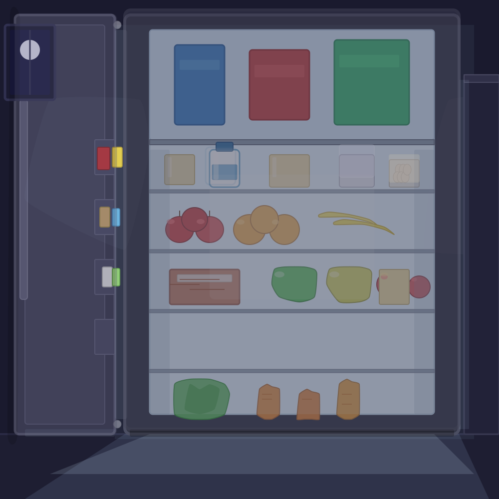
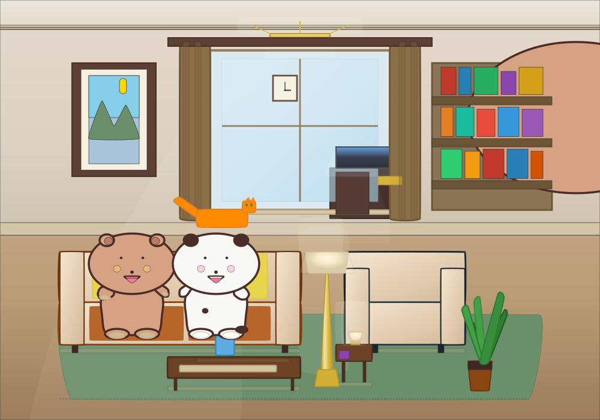
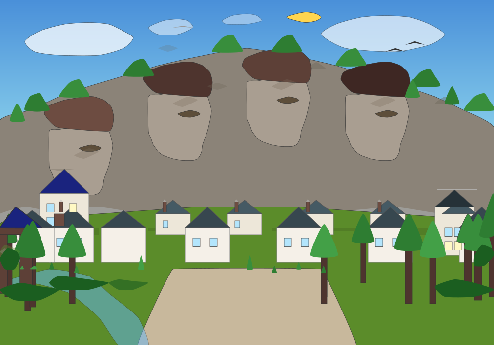
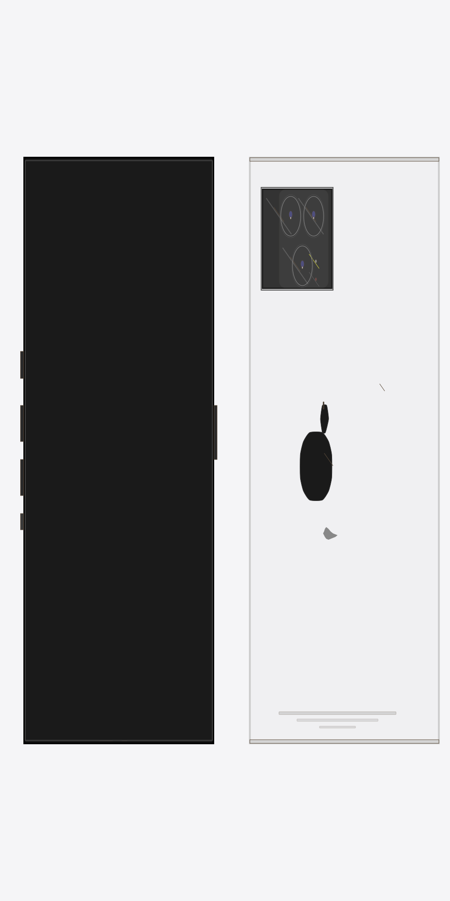
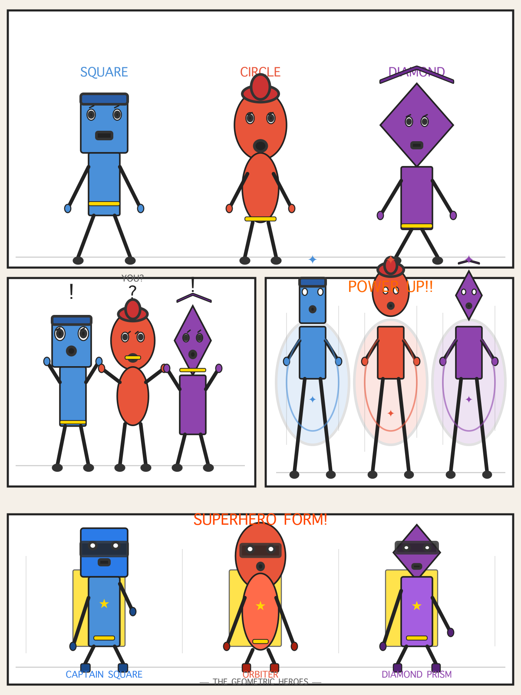
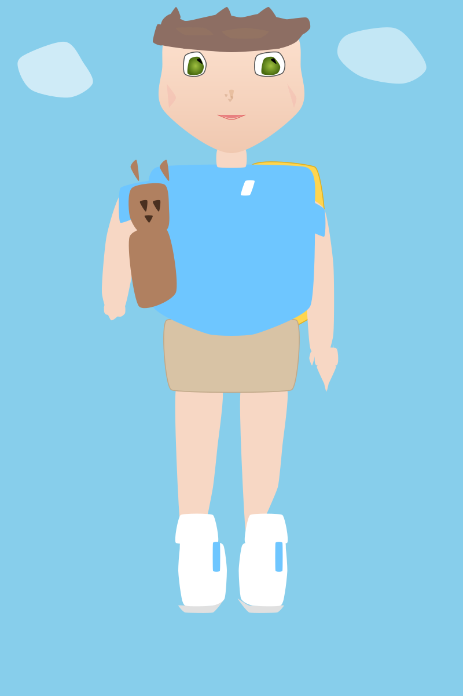

# AVGE Examples

Real illustrations built with AVGE tools. Each is a saved document that can be restored, re-rendered, or edited.

---

## Fridge Night Scene

A detailed kitchen scene with a fridge, countertop, and evening lighting. Demonstrates multi-layered construction with cel-shaded highlights and shadows.

- **124 regions** — fridge body, door, handle, interior shelves, counter, wall tiles, floor
- **Techniques**: `create_region` for boxes, `add_shading` for directional highlights, `restyle` for color tuning
- **Style**: Cel-shaded with warm ambient + cool shadow tones

[SVG](results/fridge-scene.svg)

---

## Bedroom Scene

A detailed room with bed, desk, window, posters, baseboards, and lighting.

- **166 regions** — walls, floor, ceiling, window frame, baseboard, furniture
- **Techniques**: `create_primitive` (rects), `create_curve` (curtains), z-ordering for depth
- **Style**: Flat-color 2D illustration

[SVG](results/bedroom.svg)

---

## Landscape Panorama

A wide outdoor scene with mountains, clouds, and sky gradient.

- **172 regions** — sky, distant mountains, clouds, terrain layers
- **Techniques**: Gradient backgrounds, layered depth via z_index, `create_curve` for mountain silhouettes
- **Style**: Atmospheric perspective with gradient fills

[SVG](results/landscape.svg)

---

## iPhone Mockup

A front-facing iPhone with screen, dynamic island, camera, and UI elements.

- **126 regions** — phone body, screen, dynamic island, speakers, camera lenses, UI chrome
- **Techniques**: `create_primitive` (rounded rects for body/camera), boolean operations for cutouts
- **Style**: Clean product mockup with precise proportions

[SVG](results/iphone-mockup.svg)

---

## Manga Page

A multi-panel manga/comic page layout with characters and speech bubbles.

- **253 regions** — 4 panels with borders, characters, backgrounds, speech bubbles, sfx
- **Techniques**: `speech_bubble` for dialogue, `create_burst` for impact effects, panel borders via `create_region`
- **Style**: Black-and-white manga with screen tones

[SVG](results/manga-page.svg)

---

## Character Head Study

A detailed anime-style character head with layered hair, eyes, and shading.

- **56 regions** — head base, hair layers, eyes, irises, eyebrows, mouth, shading
- **Techniques**: `segmented_chain` for hair strands, `add_shading` for skin/hair shadows, `smoothness_per_point` for curved contours
- **Style**: Anime cel-shade

[SVG](results/character-head.svg)

---

## What These Demonstrate

| Capability | Example |
|---|---|
| **Procedural geometry** | Hair via `segmented_chain`, armature skeletons |
| **Boolean operations** | Complex cutouts and merged shapes |
| **Shading** | Directional highlight/shadow on any region |
| **Primitives** | Furniture, appliances, product mockups |
| **Curves and lines** | Clothing folds, face outlines, mountain silhouettes |
| **Duplication patterns** | Radial (clock faces), grid (tiles), mirror symmetry |
| **Multi-panel layouts** | Manga/comic page with borders and balloons |
| **Text and images** | Labels, branding elements, embedded images |
| **Batch operations** | Multi-region color changes in one call |
