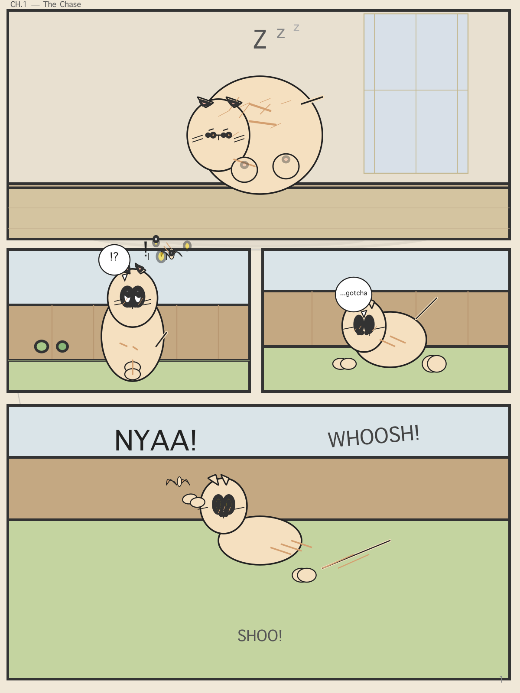
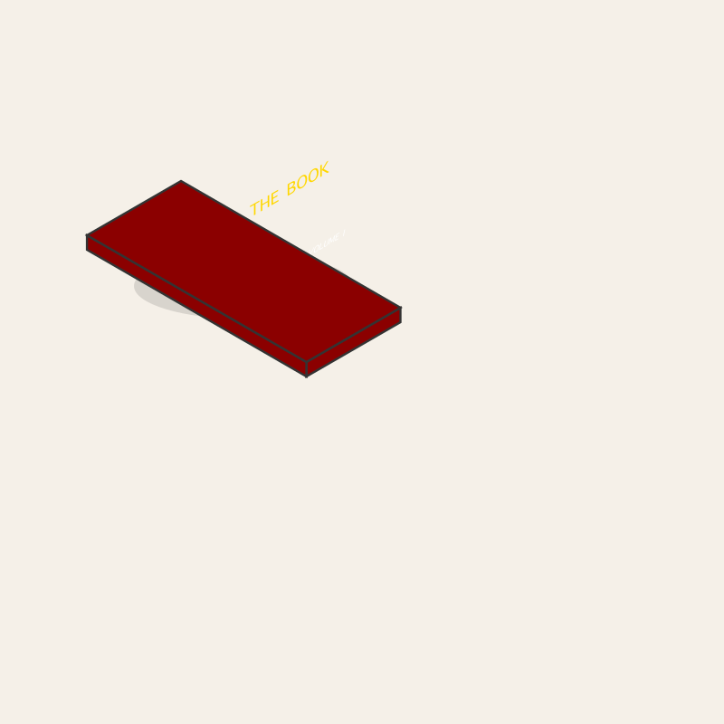
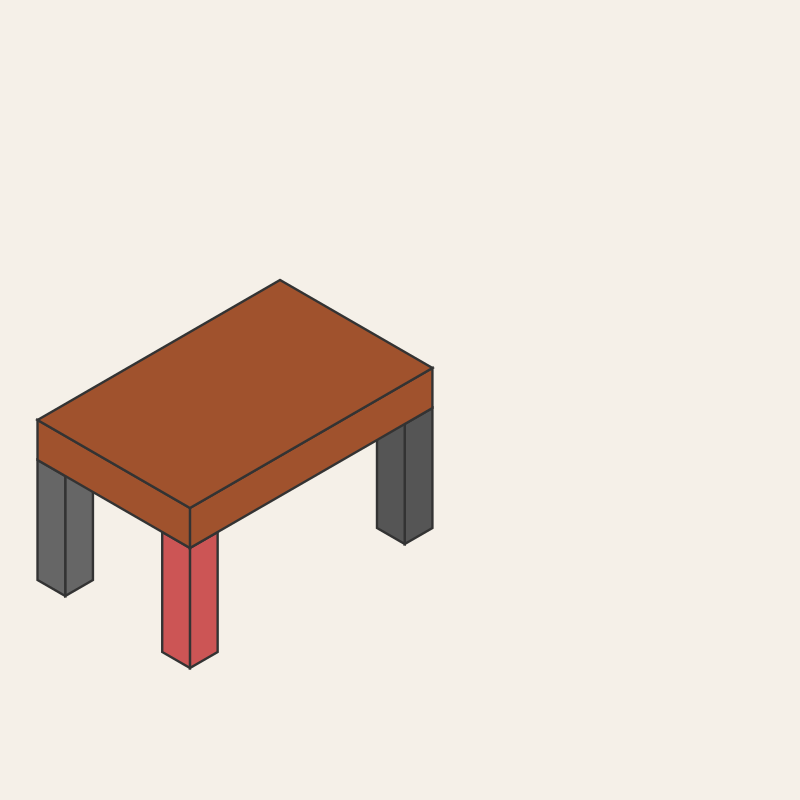

# AVGE Examples

Real illustrations built with AVGE tools. Each is a saved document that can be restored, re-rendered, or edited.

---

## Fridge Night Scene

A detailed kitchen scene with a fridge, countertop, and evening lighting. Demonstrates multi-layered construction with cel-shaded highlights and shadows.

- **124 elements** — fridge body, door, handle, interior shelves, counter, wall tiles, floor
- **Techniques**: `create_element` for boxes, `add_shading` for directional highlights, `restyle` for color tuning
- **Style**: Cel-shaded with warm ambient + cool shadow tones

[SVG](results/fridge-scene.svg)

---

## Bedroom Scene

A detailed room with bed, desk, window, posters, baseboards, and lighting.

- **166 elements** — walls, floor, ceiling, window frame, baseboard, furniture
- **Techniques**: `create_primitive` (rects), `create_curve` (curtains), z-ordering for depth
- **Style**: Flat-color 2D illustration

[SVG](results/bedroom.svg)

---

## Landscape Panorama

A wide outdoor scene with mountains, clouds, and sky gradient.

- **172 elements** — sky, distant mountains, clouds, terrain layers
- **Techniques**: Gradient backgrounds, layered depth via z_index, `create_curve` for mountain silhouettes
- **Style**: Atmospheric perspective with gradient fills

[SVG](results/landscape.svg)

---

## iPhone Mockup

A front-facing iPhone with screen, dynamic island, camera, and UI elements.

- **126 elements** — phone body, screen, dynamic island, speakers, camera lenses, UI chrome
- **Techniques**: `create_primitive` (rounded rects for body/camera), boolean operations for cutouts
- **Style**: Clean product mockup with precise proportions

[SVG](results/iphone-mockup.svg)

---

## Cat Story Manga Page

A multi-panel manga page featuring a cat character in a comic story — panels, character art, speech bubbles, and backgrounds.

- **241 elements** — 4 panels with borders, cat character (body, head, ears, eyes, whiskers), speech bubbles, backgrounds
- **Techniques**: `speech_bubble` for dialogue, `create_element` with smoothness for character curves, panel layout via coordinates
- **Style**: Black-and-white manga with character-driven storytelling

[SVG](results/cat-manga.svg)

---

## Character Head Study

A detailed anime-style character head with layered hair, eyes, and shading.

- **56 elements** — head base, hair layers, eyes, irises, eyebrows, mouth, shading
- **Techniques**: `segmented_chain` for hair strands, `add_shading` for skin/hair shadows, `smoothness_per_point` for curved contours
- **Style**: Anime cel-shade

[SVG](results/character-head.svg)

---

## Isometric Text — Book Cover

Text skewed to match an isometric face using `skew_y`. The right face has a -30° slope, and text `skew_y: -30` makes it follow the parallelogram exactly.

- **Techniques**: `skew_y` on `create_text` matches the face angle, `letter_spacing` for title tracking, `font_weight` for contrast
- **Face angles**: right face = `skew_y: -30`, left face = `skew_y: 30`
- Use `get_element` to inspect face coordinates before placing text

[SVG](results/isotext.svg)

---

## Isometric Box — Table with 5 Legs

A procedural isometric table built entirely from `isometric_box` + `attach` patterns. No manual coordinate math — legs snap to frame corners by named anchor.

- **1 frame + 5 legs = 6 calls**, zero coordinate calculations
- **Techniques**: `isometric_box` for the frame, `attach` with `parent_anchor`/`child_anchor` for leg placement, `flush=true` for auto-coplanar slant
- **Anchors**: `bottom_left`, `bottom_right`, `bottom_front`, `bottom_back_left`, `bottom_back_right`
- **Style**: Per-leg fill colors, auto shadow, painter's-algorithm z-ordering

[SVG](results/attach5.svg)

---

## What These Demonstrate

| Capability | Example |
|---|---|
| **Procedural geometry** | Hair via `segmented_chain`, armature skeletons |
| **Boolean operations** | Complex cutouts and merged shapes |
| **Shading** | Directional highlight/shadow on any element |
| **Primitives** | Furniture, appliances, product mockups |
| **Curves and lines** | Clothing folds, face outlines, mountain silhouettes |
| **Duplication patterns** | Radial (clock faces), grid (tiles), mirror symmetry |
| **Multi-panel layouts** | Manga/comic page with borders and balloons |
| **Text and images** | Labels, branding elements, embedded images |
| **Batch operations** | Multi-element color changes in one call |
